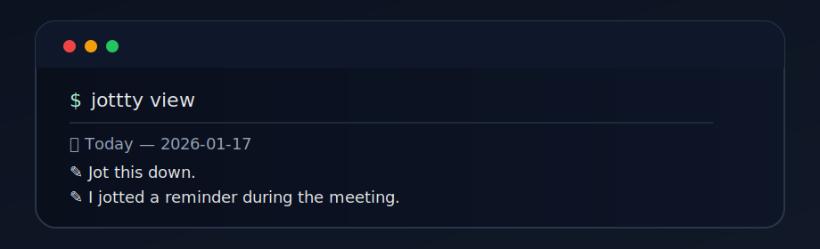

# Jottty.

Jottty is a simple and efficient note-taking application designed to help you capture your thoughts, ideas, 
and to-do lists quickly. With a clean and intuitive interface, Jottty makes it easy to organize your notes
and access them whenever you need.


## What jot means?

To jot = to make a short, quick note so you don’t forget.



# How to install.


## Usage

```bash
> jottty add "This is a bullet note in today's journal"
```
You can list all your journals:

```bash
> jottty list
journals/
  ├── 2026-01-10.md
  ├── 2026-01-09.md
  └── 2026-01-08.md
```

You can view a specific journal by date:

```bash
> jottty view 2026-01-09  
```

```markdown
# 2026-01-09
- This is a bullet note in past journal
```


More commands:

```bash
> jottty view   ;; can view the todays journal directlyf    
> jottty add "TODO: Finish the project" ;; TODO: is a tag
> jottty search "TODO" ;; search all journals for the string
> jottty tag --filter "TODO" ;; list all tags
```

You can also edit the file directly:
This will open the today's journal in your default text editor or you can set 
the EDITOR in the configuration file.

```bash
> jottty edit
```

## Configuration

You can configure jottty by creating a configuration file at `~/.jottty/config.toml`.
Here is an example configuration:

```toml
bullet_prefix = "- "
editor = "nvim"
dir = "~/.jottty"
```

